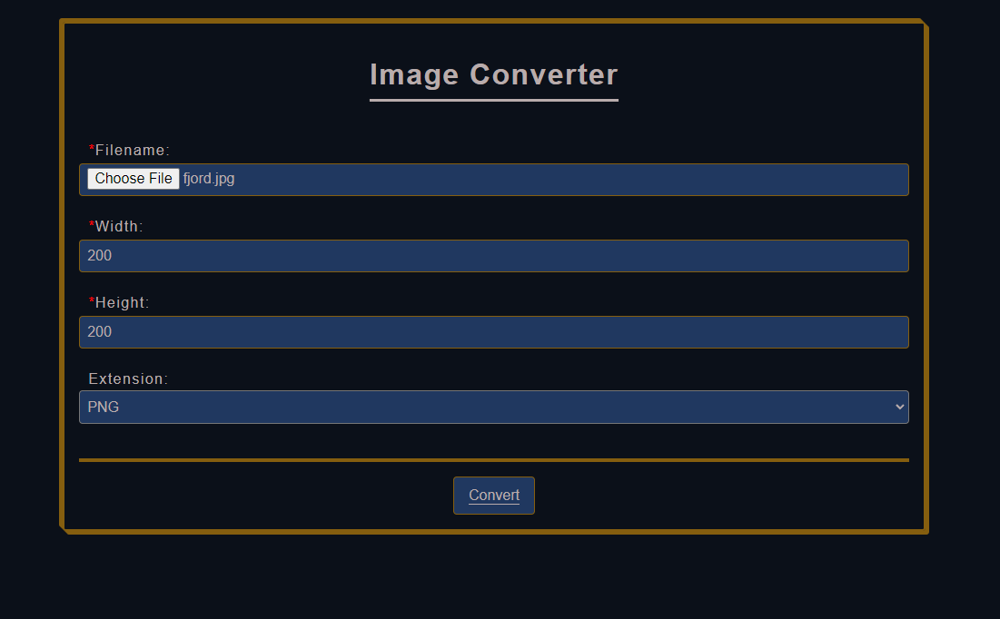
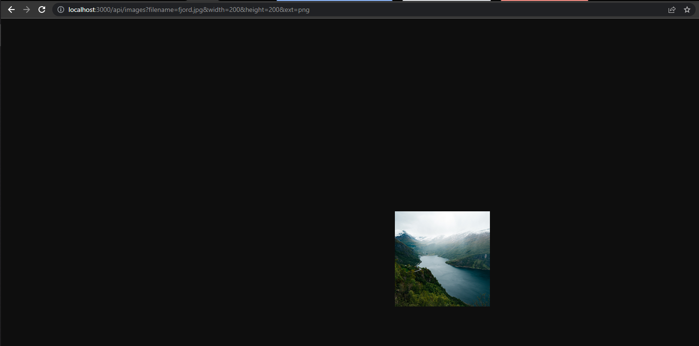

# image-processing-api

Udacity FWD's first project

## This project servers as a placeholder api and an image conversion api.

---

## Setup:

Install:

```bash
git clone https://github.com/ahmed-hany94/image-processing-api

cd image-processing-api

yarn install
```

Run:

```bash
yarn start
```

## Routes:

### **/**

redirects to /public/index.html for the submission form.

### **/api/images/**

A listing of the files in `./assets/full` directory.


### **/public/index.html**

You submit an image as shown below with the desired dimensions & an optional extension to be converted into.



If the operation is successful, the browser takes you to the image served by the express server.

### **/api/images?filename=<filename.ext>&width=<number>&height=<number>&ext=<ext>**


http://localhost:3000/api/images?filename=fjord.jpg&width=200&height=200&ext=png

If you go to a url of an already converted image, express servers the cached image file from its directory without converting it again.

---

### Notes:

- Using the submission form is preferred.
- Files that are converted are found in /assets/thumb with the format: `<filename>-<width>-<height>.<ext>`
- 💀 url format must be as mentioned `/api/images?filename=<filename.ext>&width=<number>&height=<number>&ext=<ext>` when using the api directly without using the submission form.
  - exmaple: http://localhost:3000/api/images?filename=fjord.jpg&width=200&height=200&ext=png
  - If the filename's extension is missing the `filename` param, an error page will be shown
  - If the params are not typed correctly, an error page will be shown.
  - If the `ext` is not specified, the coverted image will be of the desired dimension but the same original extension.
